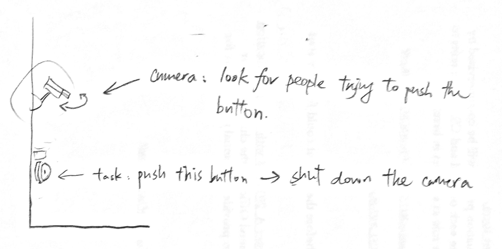
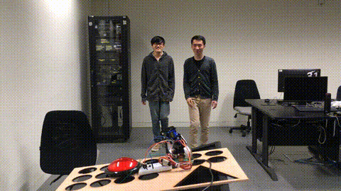
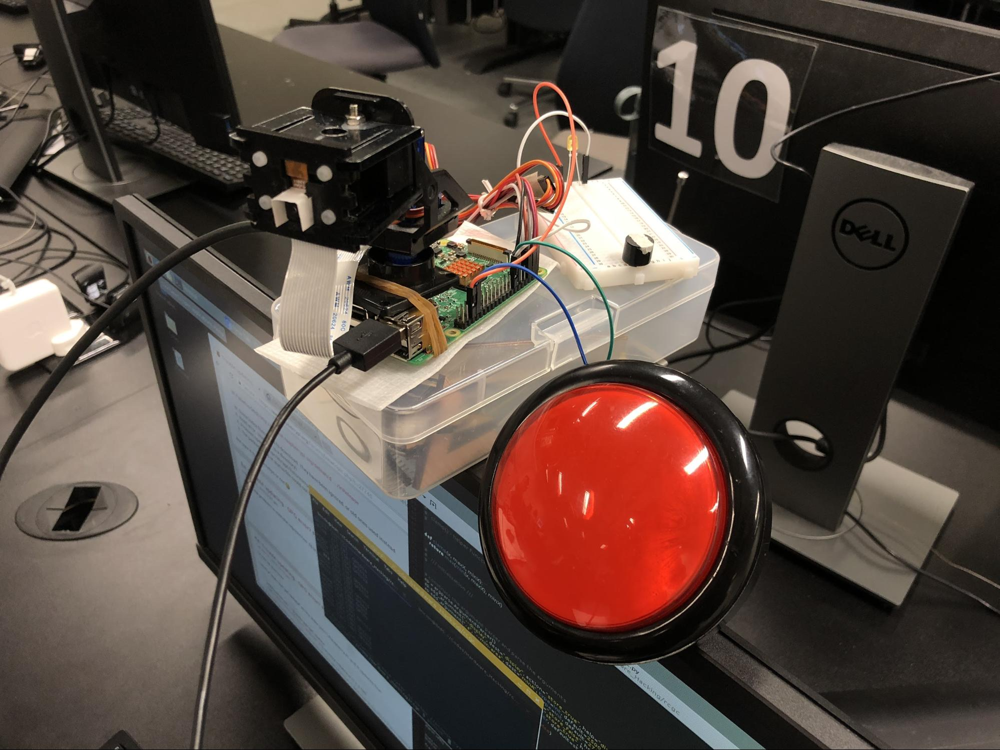
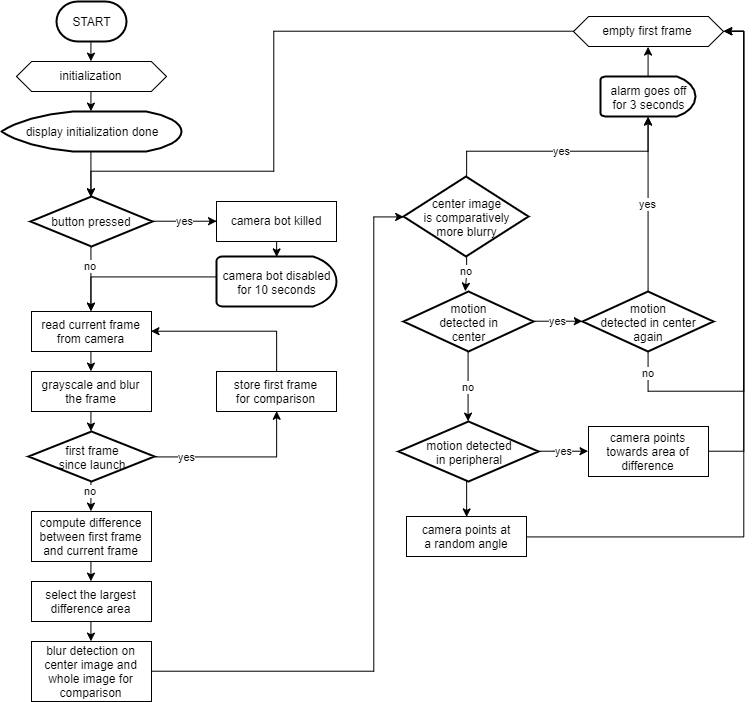
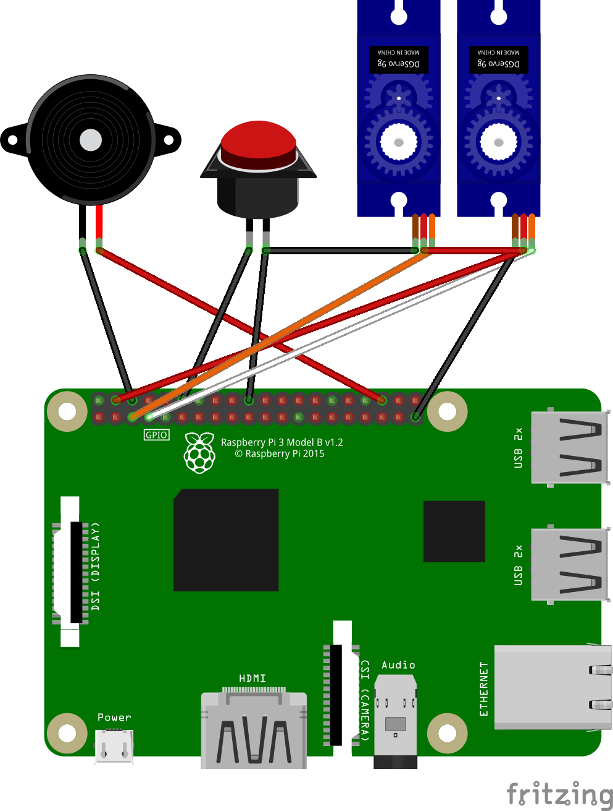
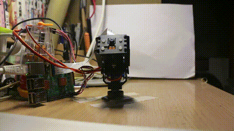

# RED CAM, GREEN CAM :vertical_traffic_light:

>SM3610 Hardware Hacking Final Project
>**Contributor:** Michael Chan

Motion-based game in light of the famous classic game [Red Light, Green Light](https://en.wikipedia.org/wiki/Statues_(game))
**Goal:** Start far from the camera reaching for the big red button just next to the camera bot without getting noticed by it.

## Demo

[https://vimeo.com/247120163](https://vimeo.com/247120163)

## Setup

 - Raspberry Pi x 1 	
 - Servo Motor x 2
 - Pi Camera x 1	
 - Camera Rig x 1
 - Buzzer x 1		
 - Button x 1
 - Wires x 10

## Python Dependency

OpenCV 	- Motion and blur detection
GPIOZero 	- Servo motors and buzzer control
ImUtils	- Camera frame preprocessing

## Main Logic

> Camera bot = Motion detection + Blur detection + Camera control

Define a triggering region at the center of the captured frame, 
 - Motion Detected *outside* the region => point camera towards it
 - Motion Detected *inside* the region => fire the alarm

## Program Flow

## Circuit Design

Camera need to attach to raspberry pi via CSI too

## References

Motion detection with OpenCV and Python [https://www.pyimagesearch.com/2015/05/25/basic-motion-detection-and-tracking-with-python-and-opencv/](https://www.pyimagesearch.com/2015/05/25/basic-motion-detection-and-tracking-with-python-and-opencv/)

Control Servo motor using Raspberry Pi 3 [http://razzpisampler.oreilly.com/ch05.html](http://razzpisampler.oreilly.com/ch05.html)

## Notes

  
After the servo motors move into position, it may tries to calibrate and cause the camera to shake.  We remove this behaviour by detaching the servos after angle movement.